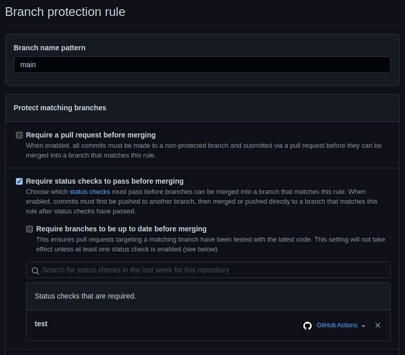

# Backend Developer Test

Hi dev! This is a test for devs want to apply to the backend developer position on Videsk.

**With this test expects you will learn about Test-Driven Development, how transform synchronous operations to asynchronous, catch errors, setup environments and check how works automated test and deployment as DevOps.**

```
Follow the deadlines and rules where you got this link.
```

If you're a recruiter you're welcome to fork this repository and use it in your recruitment process, but with author reference.

In case you're a curious developer, use it as a homework to practice Javascript for backend, best practices between stages, and deployment workflows.

# Rules ☝

1. **Not fork!** Clone this repository. 🚨
2. **Never** push directly to the `main` branch. 🚨
3. Work over files `test1.js`,`test2.js` and `test3.js`. 🚨
3. **Use [conventional commits](https://www.conventionalcommits.org/en/v1.0.0/)** 🚨
3. Don\'t modify nothing in `test/`, `utils/` and `.github/` folders.
4. All exported functions on test files are required, don't modify this. You will need to work inside the functions.

# Deadlines

Send in a maximum of 5 days, if you exceed this deadline, you will not be selected, but you may receive a feedback of your code. Be responsible.

# How to send

The way to send the test to Videsk for review is really easy, but pay attention.

This repository contains a GitHub Action on `.github/workflows/main.yml`, where will be trigger automatically on every pull request and push on main, staging and develop.

The way to send us your test completed is creating a new pull request from `develop` -> `staging` -> `main`. Only in `main` will send to us the notification test is complete, but remember this is like send to production, so check your code before merge to `main`.

# Steps

Read the following steps to send a correct test.

## Setup

```
This test needs latest Node LTS installed on your machine.
```

1. Add secrets we sent you to this repository exactly as we write you.
2. Create branches `main`, `staging` and `develop`.
3. Add protection to the `main` branch with `Require status checks to pass before merging` in repository settings. In case of `status checks` set the action `test`.

Need looks like this:



This will ensure you that the test will pass before send to `main`.

---

## Tests

You can test locally with `mocha`. To run test can write in terminal:

- Test 1: `npm run test:1`
- Test 2: `npm run test:2`
- Test 3: `npm run test:3`
- Test only mandatory: `npm run test:mandatory`
- Test all: `npm run test:all` (including bonus)

**We suggest you use debug of your IDE or code editor.**

## Test 1

In this test `./test1.js` we have a function that receive the argument `server`, which have an events' listener:

```js
server.on(eventName, callback);
```

This test is failing because the `Test1` is not returning the argument value of the callback. So, you will need to find a way to return the callback argument value, understanding the event `name` could be invoked after a few seconds.

In short, you will need to deal with:

- [ ] `server.on(...)` method does not return value so you can't `const name = server.on(...)`
- [ ] `server.on('name', callback)` could be invoked after a `N` seconds.

---

## Test 2

Here is a context of classic querying to database in MongoDB, where can return different results and sometimes errors.

Your job is:

- [ ] When the result of querying to database is empty array throw an `NotFound` error.
- [ ] When the result of querying to database is an unexpected error throw an `ServerError` error.

Be sure the errors were not crash the app, does mean if you don't catch the error correctly the server will be stopped. We catch correctly in the test, but in the real world, that's equal to server down!

---

## Test 3 (Optional Bonus)

This is a complete optional test! It's more complex than the previous tests because is focused on create a server as a class, with method could allow to us querying on database.

You will learn about how works in the most simple way querying of MongoDB, handle exceptions, returns the correct errors and create a class.

1. Create a constructor to store the db
2. Create methods
    - [ ] `find`
    - [ ] `findOne`
    - [ ] `updateOne`
    
Here you will need to use `sift` to receive the query to filter on db. [Check more info of sift](https://github.com/crcn/sift.js).

The `db` is a object with keys which are "collections", every collection contains an Array with objects are equals to documents in MongoDB.

You can base on the file `./test/utils/server.js`, specifically on the method `query()`.

The "models" are in the file `./test/utils/db.js`.

```js
// find method
const query = { createdAt: 1638397184005 };
server.find(collectionName, query); // Expected output [{...}, {...}, ...]

// findOne method
server.findOne(collectionName, documentId); // Expected output {...}

// updateOne method
server.updateOne(collectionName, documentId, dataToUpdate); // Expected output {...}
```

3. Based on the previous test `Test2` apply the same logic of `NotFound` error when the array is empty or element to update not exist.

# Built with?

- NodeJS
- Faker.js
- Sift.js
- Mocha
- Chai

---

# Bugs

If you detect a bug, please create a new issue in the original repository, we resolve it at the fastest possible.

# License
MIT, developed by Videsk with ❤️.


